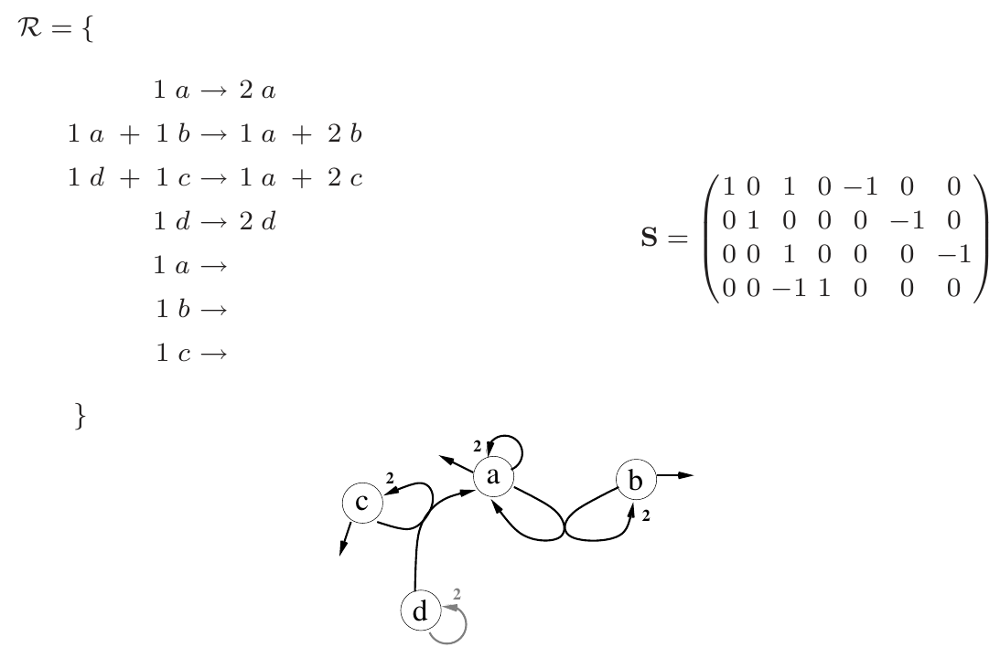

# Artificial Life Models in Software

## Chapter 10: Artificial Chemistries (Kaleta)

There is a thing called Chemical Organization Theory. Computer simulations generate a lot of data in a short time, which wet chemistries can't. "These fields try to understand real living systems not by considering them in mechanistic detail, but from an abstract point of view. Thus, they study how concepts like self-replication of information processing and storage might have evolved." Systems Biology Markup Language (SBML) is suggested as a standard for representation of reaction networks. Systems Biology Workbench (SBW) interfaces with a variety of programming languages and can load a reaction network specified in SBML and do analysis on it. Perhaps MetaChem can be implemented in XML?



# Banzhaf & Yamamoto book

Remember that SS stressed the importance of the bibliography.

*Nonconstructive chemistry:* one in which all the molecular objects are known beforehand.

*Well-stirred vessel:* A reaction vessel in which the actual position of the molecules is not modelled and so has no effect on the reactions taking place. The state of the system in a well-stirred vessel is fully described by the concentrations of each species present.

*Spatial reactor:* A reaction vessel that takes account of the physical distance between potential reactants. They cannot react unless they meet.

### The general structure of an AC

* S: The set of molecules.
This can be infinite.
* R: The rules by which molecules combine. When two molecules collide, if a set of rules is fulfilled then combination occurs. Parameters for proximity, rate, probability of reaction, energy, etc, can be included here.
* A: The algorithm describing the dynamics of the reactor vessel, e.g. is it well-stirred or spatial, does it have inflow and outflow, and how are collisions modelled.

#### Modelling collisions

##### Stochastic collisions

This is the naive approach that immediately suggests itself. The system is sampled at random (perhaps according to concentration) and a collision is then assumed between the selected molecules. A matching rule is sought and if one is found then the molecules combine according to the rule, otherwise they return to the reactor. Each collision is a separate event. *Most systems of interest are open systems relying on an inflow of raw materials and energy and an outflow of waste.* Presumably closed systems reach an equilibrium quickly.

This approach is inefficient when most collisions turn out to be elastic (ie no combination happens). It is also difficult to model arbitrary reactions between more than two molecules.

##### Specialized stochastic simulation algorithms

Some specialized algorithms that mimic stochastic processes have been developed to try to overcome the disadvantages of stochastic sampling of collisions, the most famous of which is [Gillespie's stochastic simulation algorithm (SSA)](https://en.wikipedia.org/wiki/Gillespie_algorithm). The principal advantage of this algorithm is that it doesn't compute elastic collisions. Chapter 4 deals with this type of algorithm.

##### Continuous differential or discrete difference equations

This approach uses systems of differential equations in which the set of ODEs at time t determine the changes to the system at time t and therefore the set of ODEs at time t+1. This approach is not considered appropriate for constructive ACs in which the aim to generate novelty and emergent complexity.

##### Metadynamics

This approach aims to address the problem of novelty in the ODE approach by adding and removing ODEs over time. A further refinement called stochastic metadynamics introduces novelty through random events. In most implementations the ODEs need to be solved numerically.

#### Other distinctions

##### Explicit vs Implicit: Defining the Set S

An explicit chemistry is one in which the possible molecules are known a priori and can be enumerated. An implicit chemistry is one in which the possible molecules are specified by an expression or set of instructions as to how molecules can be constructed, but an enumeration is impossible.

The RGB chameleons are given as a non-constructive explicit chemistry (ie no new colours of chameleons appear and all possible chameleons are known at the outset). The number division chemistry is given as an example of a constructive implicit chemistry. Numbers appear in the system that were not in the initial system and it isn't possible to say at the outset what the population will comprise in the future.

#### Some AC techniques

##### Measuring time

Time in an AChem is proportional to the number of collisions and inversely proportional to the size of the reactor. Hence

$$t = N/M$$

where N is the number of collisions and M is the size of the reactor. In this way, the reaction rate slows down if (a) the number of collisions decreases or (b) the size of the reactor increase, both of which are intuitive.


## York referencing (#referencing)
## List of relevant articles
## MetaChem
## Source code examples and breakdown

It's very easy to make some words **bold** and other words *italic*  and yet other ~~strikethrough~~ with Markdown. You can even [link to Google!](http://google.com)

# This is an <h1> tag
## This is an <h2> tag
###### This is an <h6> tag

* Item 1
* Item 2
  * Item 2a
  * Item 2b

  1. Item 1
  1. Item 2
  1. Item 3
     1. Item 3a
     1. Item 3b


Format: 

```javascript
function fancyAlert(arg) {
  if(arg) {
    $.facebox({div:'#foo'})
  }
}
```

First Header | Second Header
------------ | -------------
Content from cell 1 | Content from cell 2
Content in the first column | Content in the second column

Links
http://github.com - automatic!
[GitHub](http://github.com)

Blockquotes
As Kanye West said:

> We're living the future so
> the present is our past.

Inline code
I think you should use an
`<addr>` element here instead.

[Top of page](#top)
